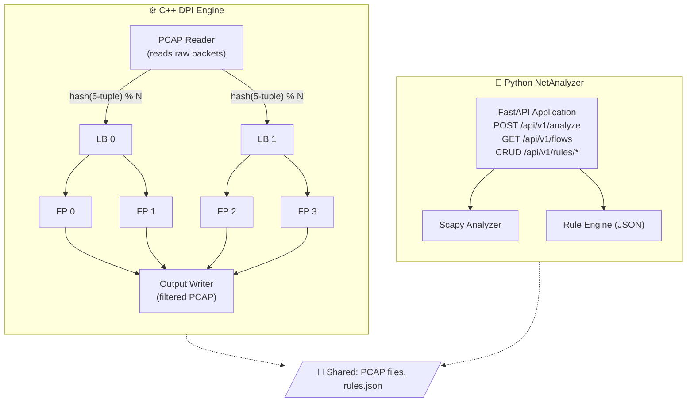

<p align="center">
  <h1 align="center">🛡️ DPI Platform</h1>
  <p align="center">
    <strong>High-Performance Deep Packet Inspection Engine + REST API</strong>
  </p>
  <p align="center">
    <a href="#-quick-start"></a>
    <a href="#-api-reference"></a>
    <a href="#-architecture"></a>
    <a href="LICENSE"></a>
  </p>
</p>

---

## What Is This?

DPI Platform is a **network traffic analysis system** that reads captured network traffic (PCAP files), inspects every packet down to the application layer, identifies which app or service generated the traffic, and optionally blocks unwanted connections — all without breaking encryption.

It ships as **two independent components** that share PCAP files and rules:

| Component | Built With | What It Does |
|-----------|------------|--------------|
| **DPI Engine** | C++17, pthreads | Reads PCAPs at high speed using a multi-threaded pipeline. Parses protocols (Ethernet → IP → TCP/UDP → TLS), extracts SNI hostnames, classifies traffic by application, enforces blocking rules, and writes filtered output. |
| **NetAnalyzer** | Python 3.11, FastAPI, Scapy | Provides a REST API for uploading PCAPs, querying analysis results, and managing blocking rules. Ideal for integration with dashboards and automation tools. |

Both can run together via **Docker Compose**, or independently.

---

## 📑 Table of Contents

1. [Quick Start](#-quick-start)
2. [How It Works — The DPI Pipeline](#-how-it-works--the-dpi-pipeline)
3. [Architecture & Threading Model](#-architecture--threading-model)
4. [Project Structure](#-project-structure)
5. [C++ Engine — Usage & Options](#-c-engine--usage--options)
6. [Python API — NetAnalyzer](#-python-api--netanalyzer)
7. [API Reference](#-api-reference)
8. [Docker Deployment](#-docker-deployment)
9. [Building from Source](#-building-from-source)
10. [Configuration](#-configuration)
11. [Testing](#-testing)
12. [License](#-license)

---

## 🚀 Quick Start

### Option 1 — Docker (Recommended)

```bash
git clone https://github.com/Izhaar-ahmed/DPI-platform.git
cd DPI-platform

# Start the REST API
docker compose up -d netanalyzer

# Upload and analyze a PCAP file
curl -X POST http://localhost:8000/api/v1/analyze \
  -F "file=@test_dpi.pcap"

# Or run the C++ engine directly
docker compose run --rm dpi-engine /data/test_dpi.pcap /output/result.pcap \
  --block-app YouTube
```

### Option 2 — Build Locally

```bash
# Build the C++ engine
cmake -B build && cmake --build build

# Run analysis (blocks YouTube traffic, writes filtered output)
./build/dpi_engine test_dpi.pcap output.pcap --block-app YouTube

# Start the Python API
cd netanalyzer
pip install -r requirements.txt
uvicorn app.main:app --host 0.0.0.0 --port 8000
```

---

## 🔍 How It Works — The DPI Pipeline

Every packet goes through **four stages**. Here's what happens at each one:

### Stage 1 — Parse Protocol Layers

The engine peels apart each packet layer by layer, extracting metadata at each level:

```
Ethernet Frame
 └─ MAC addresses, EtherType (is it IPv4?)
     └─ IPv4 Header
         └─ Source IP, Destination IP, Protocol (TCP or UDP?), TTL
             └─ TCP / UDP Header
                 └─ Source Port, Destination Port, Flags, Sequence Numbers
                     └─ Application Payload (TLS, HTTP, DNS, etc.)
```

### Stage 2 — Track Flows

Packets don't exist in isolation — they belong to **connections** (flows). The engine groups packets using the **five-tuple**:

```
(Source IP, Destination IP, Source Port, Destination Port, Protocol)
```

A hash of the five-tuple is used as the flow identifier. All packets with the same five-tuple are processed by the **same thread**, which means the engine can track connection state (SYN → SYN-ACK → established → FIN) without needing locks.

### Stage 3 — Classify the Application

Even though HTTPS traffic is encrypted, the **TLS Client Hello** message includes the destination hostname in plaintext — this is the **Server Name Indication (SNI)** field:

```
TLS Record
  Content Type: 0x16 (Handshake)
  └── Handshake Type: 0x01 (Client Hello)
      ├── Version, Random, Session ID …
      └── Extensions
          └── SNI Extension (type 0x0000)
              └── "www.youtube.com"  ← extracted!
```

The engine also extracts the `Host:` header from plaintext HTTP traffic and can parse DNS queries.

Once a hostname is extracted, it's matched against a table of known domain signatures using **suffix matching** — `youtube.com` matches `www.youtube.com` but does *not* match `youtubedownloader.com`.

**Currently recognized applications:**
Google · YouTube · Facebook · Instagram · Twitter/X · TikTok · Netflix · Amazon · Microsoft · Apple · WhatsApp · Telegram · Discord · Spotify · Zoom · GitHub · Cloudflare

### Stage 4 — Enforce Blocking Rules

If a flow matches any active rule, the engine marks the **entire flow** as blocked — all future packets on that connection are dropped:

```
Packet 1  (SYN)          → No SNI yet       → Forward ✓
Packet 2  (SYN-ACK)      → No SNI yet       → Forward ✓
Packet 3  (Client Hello) → SNI: youtube.com  → Flow BLOCKED ✗
Packet 4+ (any data)     → Flow is blocked   → Drop ✗
```

This is important: blocking happens at the **flow level**, not the packet level. Once a flow is classified and matches a rule, it stays blocked for the entire connection lifetime.

---

## 🏗 Architecture & Threading Model

The C++ engine uses a **pipelined, multi-threaded architecture** where each stage runs on its own thread(s):



### Thread Responsibilities

| Stage | Threads | What It Does |
|-------|---------|--------------|
| **Reader** | 1 | Reads packets from the input PCAP, parses headers, computes the five-tuple hash, and dispatches each packet to the correct Load Balancer. |
| **Load Balancers (LB)** | N (default: 2) | Receive packets from the Reader and distribute them to Fast Paths via consistent hashing. This second level of distribution allows scaling the number of DPI threads independently. |
| **Fast Paths (FP)** | M per LB (default: 2) | The core DPI workers. Each FP thread maintains its own `ConnectionTracker` and performs: SNI extraction, HTTP Host parsing, application classification, TCP state tracking, and rule enforcement. |
| **Output Writer** | 1 | Collects forwarded packets from all FP threads and writes them to the output PCAP file. |

> **Why consistent hashing?** All packets from the same connection (five-tuple) are always routed to the **same Fast Path thread**. This means each FP can track connection state in its own local hash map — no locks, no contention, no data races.

**Inter-thread communication** uses a bounded, thread-safe queue (`ThreadSafeQueue<T>`) built on `std::mutex` + `std::condition_variable`, with backpressure (blocks when full) and graceful shutdown support.

---

## 📁 Project Structure

```
DPI-platform/
│
├── include/                          C++ Headers
│   ├── pcap_reader.h                  PCAP file reading & validation
│   ├── packet_parser.h                Ethernet/IP/TCP/UDP parsing
│   ├── sni_extractor.h                TLS SNI & HTTP Host extraction
│   ├── types.h                        FiveTuple, AppType, Flow structs
│   ├── rule_manager.h                 Blocking rules (IP/App/Domain/Port)
│   ├── connection_tracker.h           Stateful flow tracking
│   ├── load_balancer.h                LB thread implementation
│   ├── fast_path.h                    FP thread (DPI processing)
│   ├── thread_safe_queue.h            Lock-free concurrent queue
│   ├── dpi_engine.h                   Main orchestrator
│   └── platform.h                     Cross-platform byte order utils
│
├── src/                              C++ Source
│   ├── main_dpi.cpp                   Entry point — CLI arg parsing
│   ├── dpi_engine.cpp                 Pipeline orchestrator (start/stop/drain)
│   ├── fast_path.cpp                  Per-thread DPI processing
│   ├── load_balancer.cpp              Packet distribution logic
│   ├── connection_tracker.cpp         Flow table management
│   ├── rule_manager.cpp               Rule loading (JSON/INI), hot-reload
│   ├── pcap_reader.cpp                Binary PCAP file I/O
│   ├── packet_parser.cpp              Protocol header dissection
│   ├── sni_extractor.cpp              TLS/HTTP/DNS/QUIC deep inspection
│   ├── types.cpp                      Domain→App mapping with suffix match
│   ├── main_working.cpp               Standalone single-threaded demo
│   ├── main.cpp                       Legacy simple packet viewer
│   └── main_simple.cpp                Minimal prototype
│
├── netanalyzer/                      Python FastAPI Service
│   ├── app/
│   │   ├── main.py                    App setup, CORS, logging, health check
│   │   ├── core/
│   │   │   ├── config.py              Pydantic settings (env vars)
│   │   │   └── exceptions.py          Custom error types
│   │   ├── models/
│   │   │   ├── analysis.py            AnalysisResult, AnalysisStats
│   │   │   ├── flow.py                FlowInfo, FlowSummary
│   │   │   └── rules.py               Rules schema
│   │   ├── routers/
│   │   │   ├── analysis.py            POST /analyze, GET /stats
│   │   │   ├── flows.py               GET /flows, GET /flows/{id}
│   │   │   └── rules.py               Full CRUD for blocking rules
│   │   └── services/
│   │       ├── pcap_analyzer.py       Scapy-based PCAP analysis
│   │       ├── sni_extractor.py       Python SNI extraction
│   │       ├── classifier.py          SNI → App classification
│   │       ├── rule_engine.py         Rule evaluation engine
│   │       └── flow_store.py          In-memory flow storage
│   ├── tests/                         Pytest test suite
│   ├── Dockerfile                     Python service container
│   └── requirements.txt               Python dependencies
│
├── docker/
│   └── Dockerfile.cpp                 Multi-stage C++ build container
│
├── docker-compose.yml                 Production deployment
├── docker-compose.dev.yml             Development overrides (hot-reload)
├── CMakeLists.txt                     CMake build config (3 targets)
├── generate_test_pcap.py              Script to create synthetic test traffic
├── test_dpi.pcap                      Sample capture file
└── LICENSE                            MIT License
```

---

## ⚙ C++ Engine — Usage & Options

### Build Targets

CMake produces **three executables**, each serving a different purpose:

| Target | Entry Point | Description |
|--------|-------------|-------------|
| `dpi_engine` | `main_dpi.cpp` | **Production** — Full multi-threaded pipeline with load balancers, fast paths, connection tracking, and rule management. |
| `dpi_simple` | `main_working.cpp` | **Learning** — Self-contained single-threaded DPI demo. Good for understanding the core logic without threading complexity. |
| `packet_analyzer` | `main.cpp` | **Legacy** — Simple packet viewer that dumps headers. No DPI, no rules. |

### Command-Line Interface

```bash
# Basic: read input, write filtered output
./build/dpi_engine <input.pcap> <output.pcap>

# Block specific applications
./build/dpi_engine input.pcap output.pcap \
    --block-app YouTube \
    --block-app TikTok

# Block by IP, domain, or port
./build/dpi_engine input.pcap output.pcap \
    --block-ip 192.168.1.50 \
    --block-domain facebook \
    --block-domain "*.tiktok.com"

# Load rules from a JSON file
./build/dpi_engine input.pcap output.pcap --rules rules.json

# Configure threading (4 LBs × 4 FPs = 16 DPI threads)
./build/dpi_engine input.pcap output.pcap --lbs 4 --fps 4

# Export analysis results as JSON files
./build/dpi_engine input.pcap output.pcap --output-dir ./results/
```

### Blocking Rule Types

| Rule Type | How It Matches | Example |
|-----------|----------------|---------|
| **IP** | Exact source IP | `192.168.1.50` |
| **App** | Application type enum | `YouTube`, `TikTok`, `Facebook` |
| **Domain** | Suffix match (prevents misclassification) | `youtube.com` blocks `www.youtube.com` but **not** `youtubedownloader.com` |
| **Port** | Exact destination port | `6881` (BitTorrent) |

### JSON Output

When `--output-dir` is specified, three JSON files are written atomically (via temp file + rename):

| File | Contents |
|------|----------|
| `stats.json` | Packet totals, per-thread stats, forwarded/dropped counts |
| `flows.json` | Per-flow details: five-tuple, app type, SNI, connection state |
| `app_stats.json` | Per-application breakdown with percentages and detected SNIs |

### Sample Console Report

```
╔══════════════════════════════════════════════════════════════╗
║              DPI ENGINE v2.0 (Multi-threaded)                ║
╠══════════════════════════════════════════════════════════════╣
║ Load Balancers:  2    FPs per LB:  2    Total FPs:  4        ║
╚══════════════════════════════════════════════════════════════╝

╔══════════════════════════════════════════════════════════════╗
║                      PROCESSING REPORT                       ║
╠══════════════════════════════════════════════════════════════╣
║ Total Packets:                77                             ║
║ Forwarded:                    69                             ║
║ Dropped:                       8                             ║
╠══════════════════════════════════════════════════════════════╣
║                   APPLICATION BREAKDOWN                      ║
╠══════════════════════════════════════════════════════════════╣
║ HTTPS                39  50.6% ##########                    ║
║ YouTube               4   5.2% # (BLOCKED)                  ║
║ Facebook              3   3.9%                               ║
║ DNS                   4   5.2% #                             ║
╚══════════════════════════════════════════════════════════════╝
```

---

## 🐍 Python API — NetAnalyzer

A **FastAPI** service that wraps similar DPI functionality in a REST interface. Uses **Scapy** for PCAP parsing (single-threaded, simpler than the C++ engine but easy to integrate with web apps and dashboards).

### Key Features

| Feature | Description |
|---------|-------------|
| 📤 **PCAP Upload** | Upload `.pcap` / `.pcapng` files via `POST /api/v1/analyze` for instant analysis |
| 🔍 **Flow Inspection** | Query individual flows with full five-tuple, SNI, app classification, and byte counts |
| 🚫 **Rule Management** | Full CRUD for IP, app, domain, and port blocking rules |
| 📊 **Statistics** | Aggregated results with per-application breakdown and detected SNIs |
| 🩺 **Health Checks** | Liveness probe at `/health` — Docker and Kubernetes ready |
| 📝 **Swagger Docs** | Auto-generated interactive API docs at `/docs` |

---

## 📡 API Reference

### Analysis

| Method | Endpoint | Description |
|--------|----------|-------------|
| `POST` | `/api/v1/analyze` | Upload a PCAP file for analysis |
| `GET` | `/api/v1/analysis/stats` | Get latest analysis statistics |

### Flows

| Method | Endpoint | Description |
|--------|----------|-------------|
| `GET` | `/api/v1/flows` | List all tracked flows |
| `GET` | `/api/v1/flows/{id}` | Get details for a specific flow |

### Rules (CRUD)

| Method | Endpoint | Description |
|--------|----------|-------------|
| `GET` | `/api/v1/rules` | List all active blocking rules |
| `POST` | `/api/v1/rules/ips` | Block a source IP address |
| `DELETE` | `/api/v1/rules/ips/{ip}` | Unblock a source IP |
| `POST` | `/api/v1/rules/apps` | Block an application |
| `DELETE` | `/api/v1/rules/apps/{app}` | Unblock an application |
| `POST` | `/api/v1/rules/domains` | Block a domain |
| `DELETE` | `/api/v1/rules/domains/{domain}` | Unblock a domain |
| `POST` | `/api/v1/rules/ports` | Block a destination port |
| `DELETE` | `/api/v1/rules/ports/{port}` | Unblock a port |
| `DELETE` | `/api/v1/rules` | Clear all rules |

### Example Usage

**Analyze a PCAP:**

```bash
curl -X POST http://localhost:8000/api/v1/analyze \
  -F "file=@capture.pcap"
```

```json
{
  "stats": {
    "total_packets": 77,
    "total_flows": 12,
    "tcp_packets": 73,
    "udp_packets": 4,
    "forwarded": 69,
    "dropped": 8
  },
  "flows": [ "..." ],
  "app_breakdown": {
    "HTTPS": 39,
    "YouTube": 4,
    "DNS": 4
  },
  "analysis_time_ms": 42.3
}
```

**Manage blocking rules:**

```bash
# Block YouTube
curl -X POST http://localhost:8000/api/v1/rules/apps \
  -H "Content-Type: application/json" \
  -d '{"app": "YouTube"}'

# Block a specific IP
curl -X POST http://localhost:8000/api/v1/rules/ips \
  -H "Content-Type: application/json" \
  -d '{"ip": "192.168.1.50"}'

# View all active rules
curl http://localhost:8000/api/v1/rules
```

---

## 🐳 Docker Deployment

### Services

| Service | Port | Behavior |
|---------|------|----------|
| `netanalyzer` | `8000` | **Always-on** — Starts automatically and restarts on failure. Health-checked every 30s. |
| `dpi-engine` | — | **On-demand** — Only runs when you explicitly invoke `docker compose run`. |

### Commands

```bash
# Start the API
docker compose up -d netanalyzer

# Check service health
curl http://localhost:8000/health

# Run the C++ engine on a specific file
docker compose run --rm dpi-engine /data/input.pcap /output/result.pcap

# Development mode (with source code hot-reload)
docker compose -f docker-compose.yml -f docker-compose.dev.yml up
```

### Container Details

- **NetAnalyzer** — `python:3.11-slim` base, runs as non-root user, has built-in health checks, and uses layer-cached pip installs for fast rebuilds.
- **DPI Engine** — Multi-stage build (Ubuntu 22.04 builder → minimal runtime image), runs as non-root user, includes all three compiled binaries.

---

## 🔨 Building from Source

### Prerequisites

| Component | Requirement |
|-----------|-------------|
| C++ Engine | C++17 compiler (GCC 7+ / Clang 5+), CMake 3.16+, pthreads |
| Python API | Python 3.11+, pip |

> **Note:** The C++ engine has **zero external dependencies** — no Boost, no nlohmann/json, no libpcap. Everything is implemented from scratch using the C++ standard library only.

### Build Commands

```bash
# Standard build
cmake -B build
cmake --build build

# Verify all 3 targets were built
ls build/packet_analyzer build/dpi_engine build/dpi_simple

# Build with AddressSanitizer (for memory safety debugging)
cmake -B build -DCMAKE_BUILD_TYPE=Asan
cmake --build build
```

### Generate Test Data

```bash
python3 generate_test_pcap.py
# Creates test_dpi.pcap with synthetic traffic:
#   DNS queries, HTTP requests, HTTPS connections
#   (Google, YouTube, Facebook, GitHub, etc.)
```

---

## ⚙ Configuration

### C++ Engine — Rules File (JSON)

```json
{
  "blocked_ips": ["192.168.1.50"],
  "blocked_apps": ["YouTube", "TikTok"],
  "blocked_domains": ["tiktok.com", "*.ads.google.com"],
  "blocked_ports": [6881],
  "updated_at": "2026-01-15T10:00:00Z"
}
```

The engine supports **hot-reload** — a background thread checks the rules file every 30 seconds and automatically applies changes without restarting the engine.

### Python API — Environment Variables

| Variable | Default | Description |
|----------|---------|-------------|
| `DATA_DIR` | `./data` | Directory for `rules.json` and uploaded files |
| `LOG_LEVEL` | `INFO` | Logging verbosity (`DEBUG`, `INFO`, `WARNING`, `ERROR`) |
| `CORS_ORIGINS` | `*` | Comma-separated allowed CORS origins |
| `MAX_UPLOAD_MB` | `50` | Maximum PCAP upload size in megabytes |
| `PORT` | `8000` | Port the API listens on |

---

## 🧪 Testing

### Python API

```bash
cd netanalyzer
pip install -r requirements.txt
pytest -v
```

Test coverage includes:
- PCAP upload and analysis endpoint
- Flow storage and retrieval
- Rule engine CRUD operations
- SNI extraction accuracy

### C++ Engine

```bash
# Basic functionality test
./build/dpi_engine test_dpi.pcap output.pcap

# Determinism test — output should be identical across runs
./build/dpi_engine test_dpi.pcap out1.pcap
./build/dpi_engine test_dpi.pcap out2.pcap
diff out1.pcap out2.pcap   # should produce no output

# Memory safety test with AddressSanitizer
cmake -B build -DCMAKE_BUILD_TYPE=Asan && cmake --build build
./build/dpi_engine test_dpi.pcap output.pcap
```

---

## 📜 License

This project is licensed under the **MIT License** — see the [LICENSE](LICENSE) file for details.
